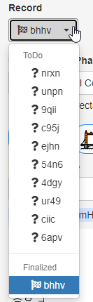

{style="float:right"}This window is shown at startup when you have classified less than 10 items. To close it, press *Esc* or click anywhere outside of it. To view it at a later time, click on *? Help*.

------------------------------------------------------------------------

Click for Mark Fox' YouTube tutorial on HRM ARM Inter-Rater Agreement.

------------------------------------------------------------------------

{style="float:right"}You can select records and phases in arbitrary sequence for classification from the dropdown boxes. Classifications can be temporarily *saved* for later modification, or *finalized* for submission.

------------------------------------------------------------------------

Select the classification by clicking on the branch of the tree. For definitions, consult the London Classification of the phase.

Cross-sections will be used for the refinement of classification criteria in the next revision of the *London Classification*.

If you did not add a cross-section, on *Save* or *Finalize* you will be nudged to add it to indicate the part of the record that best supports your classification choice.

Optionally, you can add a comment in the lower right corner.

You can infer the status of individual classifications from the icon:

Nothing done yet, , , Partially completed, Saved, Finalized

## Example cases `$ex1..$ex5`

There are 5 example cases at the top of the dropdown, marked `$ex1..$ex5` for which the balloon expulsion success is not given. These cases are just there so that you can practice with the analysis software. As and when you are happy with the controls you can skip any remaining examples, because they do not count toward study completion.

To get the example cases away from the top of the list, just dummy-rate these. Nobody gets fired for rating all examples normals.

## Navigation

-   Use the cursor keys or arrow buttons to move to next protocol section of the selected phase.
-   Press the F11 button for a full screen view to avoid scrolling.

## Reading values and creating cross sections

-   Hover to read out a value; the pressure and position at the cross is displayed in the field above the cross-section plot
-   Click/drag horizontally to create a time section plot.
-   Click/drag vertically to create cross section at a fixed time
-   Use CTRL with click/drag for unconstrained sections.
-   Only one section per classification phase is possible. Drawing a new section erases the previous.
-   To explicitly clear the section, double-click anywhere in the image, or press *Esc*.
