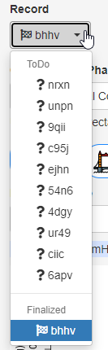
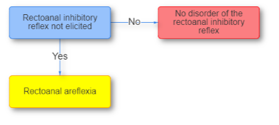
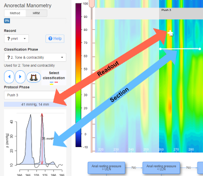

{style="float:right"}This window appease at startup if you have less than 10 items classified. To close it, press *Esc* or click anywhere outside of it. To view it later, click on _? Help_. 

---

 {style="float:right"}You can select records and phases for classification ano order from the drop-down boxes. Classifications can be *saved* temporarily for later modification, or *finalized* for submission. 

---

Select the classification by clicking on the branch of the tree. For  definitions, consult the London Classification of the phase.  

Cross-section parameters will be used for the refinement of classification criteria in the next revision of the _London Classification_. 

If you did not add a cross-section, on _Save_ or _Finalize_ you will be nudged to add it to indicate the part of the record that best supports your classification choice. 

Optionally, you can add a comment in the lower right corner. 

You can infer the status of individual classifications from the icon:

<i class="fa fa-question fa-lg">Nothing done yet</i>, 
<i class="fa fa-battery-1 fa-lg"></i>, 
<i class="fa fa-battery-2 fa-lg"></i>, 
<i class="fa fa-battery-3 fa-lg"> Partially completed</i>, 
<i class="fa fa-check fa-lg"> Saved</i>, 
<i class="fa fa-flag-checkered fa-lg"> Finalized</i>

## Navigation
- Use the cursor keys or arrow buttons to move to next protocol section of the selected phase.
- Press the F11 button for a full screen view to avoid scrolling. 

## Reading values and creating cross sections

-   Hover to read out a value; the pressure and position at the cross is displayed in the field above the cross-section plot
-   Click/drag horizontally to create a time section plot.
-   Click/drag vertically to create a cross section at a fixed time
-   Use CTRL with click/drag for unconstrained sections.
-   Only one section per classification phase is possible. Drawing a new section erases the previous.
-   To explicitly clear the section, double-click anywhere in the image, or press _Esc_.
